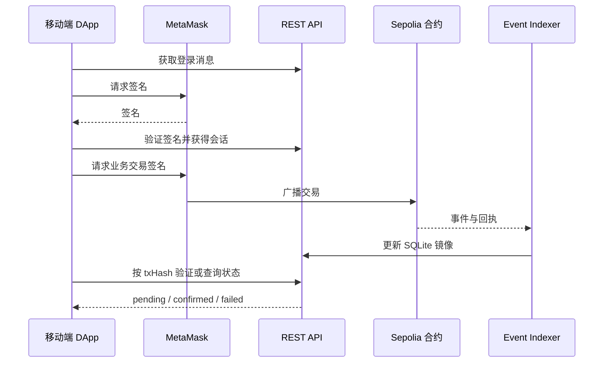

# 中小企业应收账款融资 DApp API 设计文档

> 版本：设计契约 v1.1　|　界面语言：English　|　Base path：`/api`　|　链：Ethereum Sepolia（`11155111`）

## 1. 范围与职责

本文件定义移动端 Web DApp 与 Flask 后端之间的 REST 契约。REST API 负责钱包登录、角色申请资料、链下文件、列表和详情查询、事件索引、审计统计，以及对用户已签署交易的独立验证。发票确认、报价、放款、还款、违约和裁决等金融状态由用户通过 MetaMask 调用合约；后端不得代用户签署或伪造成功状态。

本项目尚处于设计阶段。以下字段、错误码和响应结构是团队开发契约；合约 ABI、部署地址、RPC、确认数、平台费率和宽限期须在部署清单中记录实际值，不在本文虚构。结算资产统一为 Sepolia 测试 ETH，无 ERC-20 授权步骤。



## 2. 通用约定

| 项目 | 约定 |
|---|---|
| 传输 | HTTPS；JSON 请求和响应使用 UTF-8；文件上传使用 `multipart/form-data` |
| 认证 | `Authorization: Bearer <sessionToken>`；Nonce 一次性、短时有效；服务端验证签名地址、域名、chainId、时间和重放 |
| 网络 | 所有链上资源和交易都绑定 `chainId=11155111`；交易验证拒绝其他网络 |
| 钱包地址 | `0x` 前缀 20 字节十六进制；读写时规范化校验，显示时可使用校验和大小写 |
| ID | 链上业务 ID 用十进制字符串；链下草稿/文件 ID 用不透明字符串；不得把数据库自增 ID 当合约 ID |
| 金额 | 链上金额一律用 wei 的十进制整数字符串，如 `"10000000000000000"` 表示 `0.01 ETH`；客户端按 `10^18 wei = 1 ETH` 展示 |
| 利率 | `rateBps`、`holdbackBps`、`platformFeeBps` 是整数基点，`10000 = 100%` |
| 时间 | REST 字段用 ISO 8601 UTC（如 `2026-10-08T10:00:00Z`）；交易参数使用 Unix 秒；页面另显示本地时间 |
| 分页 | 列表支持 `cursor`、`limit`；`limit` 默认 20、最大 100；稳定排序为区块/事件顺序或创建时间加 ID |
| 数据来源 | 返回 `source: "indexed"`、`indexedThroughBlock`、`updatedAt`；索引落后时 UI 应标记 `Syncing…` |
| 幂等 | 链下 POST 可带 `Idempotency-Key`；同一用户、路径和键重复提交返回同一结果；链上以 `chainId + txHash + logIndex` 去重 |
| 缓存 | 私有数据 `Cache-Control: no-store`；公开部署配置可短时缓存 |

统一成功列表结构：

```json
{
  "data": [{ "id": "42" }],
  "page": { "nextCursor": null, "hasMore": false },
  "meta": { "chainId": 11155111, "source": "indexed", "indexedThroughBlock": 7000000, "updatedAt": "2026-10-08T10:00:00Z" }
}
```

统一错误结构：

```json
{
  "error": {
    "code": "CHAIN_MISMATCH",
    "message": "Switch to the Sepolia testnet.",
    "details": { "expectedChainId": 11155111 },
    "requestId": "req_01"
  }
}
```

`message` 面向用户，必须是英文；`code` 供前端稳定处理，`details` 不包含令牌、签名原文或敏感文件地址。HTTP 语义：`400` 字段错误、`401` 未登录或会话失效、`403` 角色/资源无权、`404` 不存在或不应暴露、`409` 业务状态冲突、`413` 文件过大、`422` 业务校验失败、`429` 限流、`500/503` 服务或 RPC 不可用。链上回滚不包装为 REST 成功。

## 3. 身份与角色

| Method | Endpoint | 输入 | 输出/说明 | 访问 |
|---|---|---|---|---|
| `POST` | `/api/auth/nonce` | `address`, `chainId` | `nonce`, `message`, `expiresAt`；服务端生成待签完整消息 | 匿名 |
| `POST` | `/api/auth/verify` | `address`, `message`, `signature` | `sessionToken`, `expiresAt`, `wallet`, `roles` | 匿名 |
| `GET` | `/api/auth/me` | 无 | 当前钱包、已生效角色、申请状态 | 登录 |
| `POST` | `/api/auth/logout` | 无 | 撤销当前会话 | 登录 |
| `POST` | `/api/roles/applications` | `role`, `profile`, 可选 `reason` | 链下申请 ID 和 `PendingChainRequest` 状态 | 登录 |
| `GET` | `/api/roles/applications` | `mine=true` 或 Admin 筛选 | 申请、链上请求和审核状态 | 本人/Admin |
| `GET` | `/api/roles/applications/{id}` | 无 | 申请详情、审核记录、相关 txHash | 本人/Admin |

登录请求示例：

```http
POST /api/auth/nonce
Content-Type: application/json

{"address":"0x1111111111111111111111111111111111111111","chainId":11155111}
```

服务端返回完整待签 `message`，客户端原样交给 MetaMask，不能自行拼接或修改。消息至少绑定本站域名、钱包地址、Sepolia chainId、一次性 nonce、签发与过期时间。`verify` 必须检查消息未被使用、未过期且签名恢复地址与所声称地址一致。若同一钱包拥有多个角色，`roles` 为数组。Admin 的批准动作是链上 `approveRole`；API 申请记录只表示资料审核队列。前端调用 `requestRole` 后通过交易验证接口关联申请，直到链上 `RoleApproved` 被索引才显示角色已启用。

## 4. 部署配置和文件

| Method | Endpoint | 输入 | 输出/说明 | 访问 |
|---|---|---|---|---|
| `GET` | `/api/config` | 无 | `chainId`, `settlementAsset: "native-ETH"`、合约地址、ABI 版本、区块浏览器基址、部署版本 | 公开 |
| `POST` | `/api/files` | `file`, `purpose`, 可选 `resourceId` | `fileId`, `contentHash`, `hashAlgorithm`, `sizeBytes`, `mimeType` | 登录且有上传权限 |
| `GET` | `/api/files/{fileId}` | 无 | 受权文件流或短时下载链接；不返回公开永久 URL | 文件参与方/授权审计者 |

`purpose` 为 `invoice`、`contract`、`logistics` 或 `dispute_evidence`。上传服务检查 MIME、实际文件类型、大小和恶意内容；计算完整文件哈希并在服务端保存。建议统一 SHA-256，返回 `0x` 前缀 32 字节十六进制；合约仅保存该摘要，不存原文件。上传成功不意味着发票已登记。发票核心文件哈希在 Buyer 确认后不可替换。审计用户可查看哈希和事件，原文件访问按授权策略控制。

`/api/config` 只是显示和连接配置；前端构建/部署应固定受信任的地址清单，不能仅凭任意 API 返回值把资金发往新地址。

## 5. 发票、融资和报价查询

| Method | Endpoint | 查询/请求字段 | 主要返回字段 | 访问 |
|---|---|---|---|---|
| `POST` | `/api/invoices/metadata` | `invoiceNumber`, `buyer`, `faceValue`, `issuedAt`, `dueAt`, `fileIds[]` | `draftId`, `documentHash`, `invoiceKeyPreview` | Supplier |
| `GET` | `/api/invoices` | `status`, `role`, `wallet`, `cursor`, `limit` | 发票卡片及索引元信息 | 参与方/授权只读角色 |
| `GET` | `/api/invoices/{id}` | 无 | 核心字段、状态、NFT、文件、融资、争议、事件摘要 | 参与方/授权只读角色 |
| `GET` | `/api/financing-requests` | `status`, `role`, `invoiceId`, `cursor`, `limit` | 本金、上限利率、Holdback、截止日、状态 | 参与方/授权只读角色 |
| `GET` | `/api/financing-requests/{id}` | 无 | 申请、被接受报价、放款/结算摘要 | 参与方/授权只读角色 |
| `GET` | `/api/financing-requests/{id}/offers` | `status`, `cursor`, `limit` | 报价利率、Funder、状态、提交时间 | Supplier、报价 Funder、授权只读角色 |

`POST /api/invoices/metadata` 创建链下草稿供提交前预览；它不能替代 `submitInvoice`。客户端随后用 MetaMask 提交链上交易，并用 `/api/sync/verify-transaction` 关联 `draftId`。服务端从交易事件读取最终 `invoiceId`、核心字段与哈希，检查与草稿一致后才将草稿标为 `Anchored`。若不一致则记录异常并拒绝把错误材料绑定到该发票。Buyer 确认后，以链上状态为准显示 NFT `tokenId`。

发票详情示意：

```json
{
  "data": {
    "id": "42",
    "invoiceKey": "0x…",
    "supplier": "0x1111111111111111111111111111111111111111",
    "buyer": "0x2222222222222222222222222222222222222222",
    "faceValue": "10000000000000000",
    "settlementAsset": "native-ETH",
    "issuedAt": "2026-09-01T00:00:00Z",
    "dueAt": "2026-12-01T00:00:00Z",
    "status": "Confirmed",
    "documentHash": "0x…",
    "tokenId": "42",
    "operationsFrozen": false,
    "disputeStatus": "None"
  },
  "meta": { "chainId": 11155111, "source": "indexed", "indexedThroughBlock": 7000000 }
}
```

示例中的 `0x…` 是占位符，不是可用合约地址或真实哈希。列表默认只返回调用者有权查看的数据。Auditor 可查询审计所需的公开链上字段；私有文件和用户资料依独立授权判断。

## 6. 争议、交易与审计

| Method | Endpoint | 输入/筛选 | 主要输出 | 访问 |
|---|---|---|---|---|
| `GET` | `/api/disputes/{id}` | 无 | 阶段、`disputeStatus`、冻结标识、参与方、裁决、证据哈希 | 参与方/Arbitrator/Auditor |
| `GET` | `/api/disputes` | `status`, `role`, `cursor`, `limit` | 待处理或历史争议列表 | 参与方/Arbitrator/Auditor |
| `POST` | `/api/disputes/{id}/evidence-metadata` | `fileId`, `contentHash`, `description` | 待上链证据关联 ID | 争议参与方 |
| `GET` | `/api/transactions` | `wallet`, `invoiceId`, `status`, `cursor`, `limit` | 交易哈希、函数、发送者、回执、时间 | 本人/相关参与方/Auditor |
| `GET` | `/api/transactions/{txHash}` | 无 | 交易及索引事件详情 | 相关参与方/Auditor |
| `GET` | `/api/audit/summary` | `from`, `to`, 可选状态筛选 | 发票/融资/还款/违约/争议与资金指标、统计区块 | Auditor |
| `GET` | `/api/audit/timeline/{invoiceId}` | `cursor`, `limit` | 按区块号、交易索引、日志索引排序的事件 | Auditor、该发票参与方 |
| `POST` | `/api/sync/verify-transaction` | `chainId`, `txHash`, `expectedAction`, 可选 `draftId`/`applicationId` | 验证状态和关联资源 | 登录且与交易相关 |

争议证据先上传文件并取得摘要，再由本人签署 `submitEvidenceHash`；API 里的描述和文件关联不能代替链上证据提交。审计汇总的金额字段均为 wei 整数字符串，响应包含 `asOfBlock`、`asOfTime` 和统计口径。事件时间线保存原始 `txHash`、`blockNumber`、`logIndex`、`contractAddress`、`eventName`、`payload`，前端可从浏览器核对。

交易验证请求示例：

```json
{
  "chainId": 11155111,
  "txHash": "0xaaaaaaaaaaaaaaaaaaaaaaaaaaaaaaaaaaaaaaaaaaaaaaaaaaaaaaaaaaaaaaaa",
  "expectedAction": "submitInvoice",
  "draftId": "draft_01"
}
```

交易验证响应的 `status` 只能为 `pending`、`confirmed` 或 `failed`。`pending` 时返回 HTTP `202` 和 `retryAfterSeconds`；`confirmed` 时返回 `receiptBlock`, `confirmations`, `resourceType`, `resourceId`, `indexed`；`failed` 时返回可解释错误。后端必须通过 Sepolia RPC 独立核对 `chainId`、交易目标合约、发送者、调用函数/输入、`value`（放款必须等于 `P`，还款必须等于 `V`）、回执状态、预期事件与必要确认数。`txHash` 来自前端只能作为查询线索，不能作为成功证明。RPC 暂不可用时返回 `503`，保持上次已知状态。

## 7. 链上写操作清单

下表是前端直接经 MetaMask 调用的业务函数，**不是 REST POST 接口**。准确参数以最终 ABI 为准；每类交易均应进入交易历史与事件索引。

| 合约 | 函数 | 调用者 | UI 入口 |
|---|---|---|---|
| RoleRegistry | `requestRole`, `approveRole` | 申请人、Admin | 角色申请、Admin 审核 |
| InvoiceRegistry | `submitInvoice`, `confirmInvoice`, `rejectInvoice` | Supplier、Buyer | 新建发票、Buyer 审核 |
| FinancingMarket | `openFinancing`, `cancelFinancing`, `expireFinancing` | Supplier、允许的清理调用者 | 融资申请/过期处理 |
| FinancingMarket | `submitOffer`, `withdrawOffer`, `acceptOffer` | Funder、Supplier | 报价列表/比较 |
| FinancingPool | payable `fundFinancing`, payable `repayInvoice`, `finalizeSettlement` | 被选中 Funder、Buyer、允许的结算调用者 | 放款携带 `P` wei、还款携带 `V` wei、争议结算 |
| FinancingPool | `markOverdue`, `declareDefault` | 合约允许的参与方 | 逾期/违约 |
| DisputeResolution | `openDispute`, `submitEvidenceHash`, `resolveDispute` | 参与方、Arbitrator | 争议详情 |

以上已有至少 18 类核心业务交易，超过课程的十类要求。`expireFinancing` 由设计状态机要求，但原设计文档的“交易类型”表未单独列出；实现和演示时应将它与 ABI 核对。项目无需部署测试代币或展示 `approve` 交易。

## 8. 业务字段与状态约束

| 对象 | 状态值 | 关键约束 |
|---|---|---|
| Invoice | `Draft`, `PendingConfirmation`, `Confirmed`, `FinancingOpen`, `Funded`, `Overdue`, `RepaymentDeposited`, `Repaid`, `Rejected`, `Defaulted` | `Rejected`、`Repaid`、`Defaulted` 为终态；`operationsFrozen` 独立保存 |
| Financing | `Open`, `OfferAccepted`, `Funded`, `Settled`, `Cancelled`, `Expired`, `Defaulted` | 一张发票同一时刻最多一笔活跃融资；取消/过期后可重新申请 |
| Offer | `Active`, `Accepted`, `Expired` | 放款完成由 Financing 状态表示；选中 Funder 放款超时后报价过期 |
| Dispute | `None`, `Open`, `Resolved` | 同一发票同时仅一笔未解决争议；裁决选项受阶段约束 |

金额等式与界面显示保持一致：`R = P × holdbackBps / 10000`，`SupplierUpfront = P - R`，`I = P × rateBps × financingDays / 10000 / 365`，`F = P × platformFeeBps / 10000`，`SupplierFinalPayment = V + R - P - I - F`。每一步使用合约同样的整数舍入规则。接受报价前必须验证 `V + R >= P + I + F`。正常结算和违约终态都要求该笔合约余额为零；违约记录 `PrincipalLoss = P-R`、`UnpaidInterest = I`，不声称能强制从 Buyer 钱包扣款。

### 8.1 核心响应对象字段

| 对象 | 必需字段与类型 | 说明 |
|---|---|---|
| `Invoice` | `id:string`, `invoiceKey:string`, `supplier:string`, `buyer:string`, `faceValue:string`, `settlementAsset:string`, `issuedAt:string`, `dueAt:string`, `status:string`, `documentHash:string`, `tokenId:string|null`, `operationsFrozen:boolean`, `disputeStatus:string` | `faceValue` 为 wei，`settlementAsset` 固定为 `native-ETH`；`tokenId` 在 Buyer 确认前为 `null` |
| `FinancingRequest` | `id:string`, `invoiceId:string`, `principal:string`, `maxRateBps:number`, `holdbackBps:number`, `deadline:string`, `status:string`, `acceptedOfferId:string|null` | `principal` 是 wei 整数字符串；截止时间为 UTC |
| `Offer` | `id:string`, `financingId:string`, `funder:string`, `rateBps:number`, `status:string`, `txHash:string`, `createdAt:string` | 报价状态不表示是否已放款 |
| `Funding` | `financingId:string`, `principal:string`, `holdback:string`, `netDisbursed:string`, `interest:string`, `fundedAt:string`, `dueAt:string` | 利息在实际放款时锁定 |
| `Repayment` | `invoiceId:string`, `paidAmount:string`, `interest:string`, `platformFee:string`, `supplierFinalPayment:string|null`, `depositedAt:string`, `settledAt:string|null` | 争议托管期间 `settledAt` 和最终分账可为 `null` |
| `Default` | `invoiceId:string`, `holdbackReturned:string`, `principalLoss:string`, `unpaidInterest:string`, `declaredAt:string` | 损失为审计记录，不是 Buyer 钱包扣款 |
| `Dispute` | `id:string`, `invoiceId:string`, `phase:string`, `status:string`, `operationsFrozen:boolean`, `evidence[]:array`, `resolution:string|null` | `resolution` 只可为预定义裁决或 `null` |
| `Transaction` | `chainId:number`, `txHash:string`, `from:string`, `to:string`, `action:string`, `status:string`, `blockNumber:number|null`, `events[]:array` | 未上链或待确认时 `blockNumber` 可为 `null` |

金额字符串允许 `"0"`，禁止负数、小数、科学计数法和 JSON number。地址与哈希长度在输入时校验。详情可能根据调用者权限省略受限文件与个人资料字段；公开字段的含义不得因角色变化而改变。

## 9. 安全与异常处理

- 每个写接口校验会话、角色、资源归属和单笔业务利益冲突；后端角色镜像与链上不一致时拒绝高风险链下操作并重新同步。
- 放款和还款只接受与 `P`、`V` 完全相等的 ETH `value`；前端在发起交易前同时核对转账金额和额外 Gas，后端交易验证独立核对 `value`。
- Nonce 原子消耗、设过期和限流；登录令牌短时有效并可撤销。日志不得记录原始签名、令牌或受限文件内容。
- 文件只在服务端计算哈希；存储地址不写上链；下载需要鉴权并记录访问。
- 索引器按部署起始区块分段扫描，保存检查点；使用 `chainId+txHash+logIndex` 唯一约束；遇到链重组要回滚受影响镜像后重扫。
- RPC 短时故障、后端延迟或索引落后均不能更改链上真实状态；客户端可用 txHash 恢复等待流程。
- 对 `WALLET_SIGNATURE_REJECTED`、`CHAIN_MISMATCH`、`AUTH_EXPIRED`、`ROLE_FORBIDDEN`、`RESOURCE_FORBIDDEN`、`INVALID_STATE`、`OFFER_EXPIRED`、`INSUFFICIENT_BALANCE`、`INVALID_ETH_VALUE`、`TX_PENDING`、`TX_REVERTED`、`INDEXER_LAGGING`、`RPC_UNAVAILABLE` 提供稳定错误映射。钱包拒签通常发生在客户端，未发出 REST 请求时由 UI 本地映射。

## 10. 接口验收

1. 登录签名重放、过期、换地址和错网均被拒绝；多角色返回与链上状态一致。
2. 发票元数据、文件哈希、链上登记事件三者可交叉验证；Buyer 确认后不允许篡改核心字段。
3. 每个链上成功交易都能由交易验证接口和事件时间线按 txHash 查询；失败回执不能更新成功状态。
4. 报价、放款、还款、违约和争议的 REST 镜像与链上状态一致，重复事件不产生重复记录。
5. Auditor 只能读取授权审计数据；普通用户不能查询不属于自己的私有文件或角色申请。
6. API 在 RPC 故障、索引延迟、文件错误和业务状态冲突时返回稳定错误结构。

## 11. 相关文档

[总体设计文档](设计文档.md)定义合约状态机与资金规则；[移动端 UI 设计文档](UI设计文档.md)定义页面与交易反馈；[作业要求映射与交付清单](作业要求映射与交付清单.md)定义课程验收证据。
