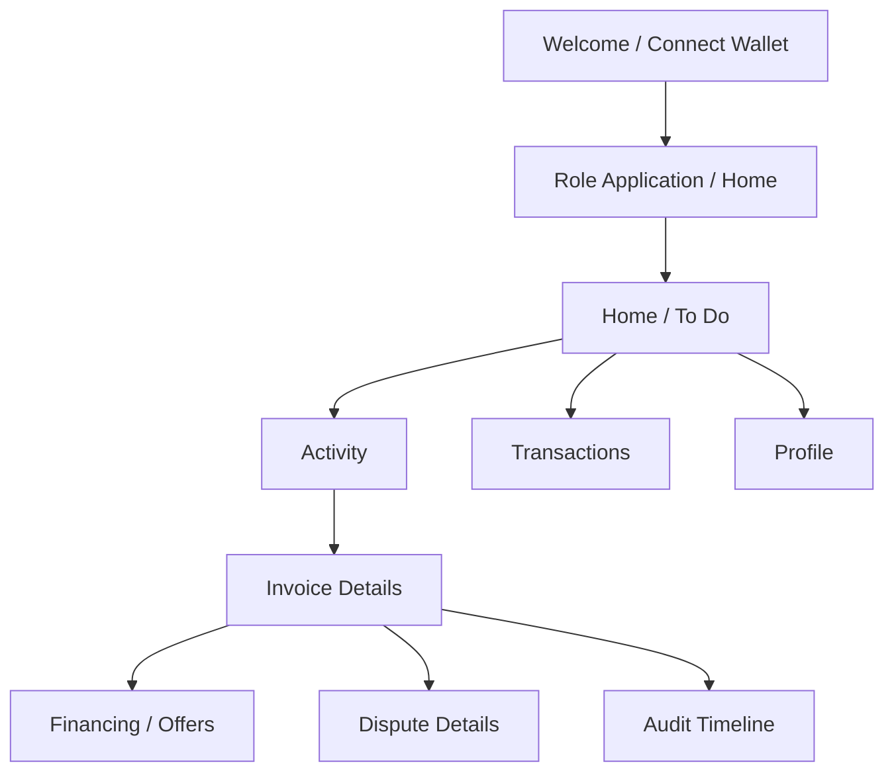

# 中小企业应收账款融资 DApp 移动端 UI 设计文档

> 版本：设计稿 v1.1　|　界面语言：English　|　目标网络：Ethereum Sepolia（chainId `11155111`）　|　钱包：MetaMask

## 1. 产品定位与设计边界

本产品面向 Supplier、Buyer、Funder、Arbitrator、Auditor 和 Admin，帮助参与方在一张已由 Buyer 确认的发票上完成一次融资、一次放款和一次还款，并提供可核对的链上审计记录。主端是手机上的响应式 Web DApp，优先在 MetaMask 移动端内置浏览器中使用；桌面端保持可用，主要服务于审计和管理场景。**产品实际界面全部使用英文**；本文的中文仅用于团队设计说明。

这是 Sepolia 教学原型，融资与还款业务金额均为 Sepolia 测试 ETH，Gas 也从同一钱包的测试 ETH 余额支付。界面不得把 Invoice NFT 描述为法律债权，也不得把测试 ETH 描述为真实美元。每个涉及签名或转账的页面都显示当前网络、钱包、转账金额、预计 Gas 和目标合约。

**设计目标**：让用户在窄屏上看清“当前状态—下一步动作—金额后果—链上结果”；在金融操作前明确展示收款方、转出金额、锁定金额、到期时间与风险；让 Auditor 能从单张发票追溯事件和资金流。

## 2. 平台和导航

| 项目 | 设计约定 |
|---|---|
| 主要视口 | 360–430 CSS px；最小支持宽度 320 CSS px；平板与桌面扩展布局 |
| 导航 | 手机底部 4 项：`Home`、`Activity`、`Transactions`、`Profile`；当前角色在顶栏切换。Arbitrator、Auditor、Admin 的 `Activity` 入口显示各自队列 |
| 页面结构 | 顶栏显示角色、Sepolia 标识、缩略钱包地址；列表用卡片；详情以纵向分段、固定底部主操作按钮呈现 |
| 深链接 | 分享发票/融资申请链接时只包含公开业务 ID；未登录或无权访问时进入登录/无权限页 |
| 桌面适配 | 左侧导航与双栏详情；保留同一业务语义和操作顺序 |
| 钱包 | 使用 MetaMask 签名登录与交易签名，通过 Ethers.js 6 调用合约；应用和后端不接触助记词或私钥 |

页面必须处理 `accountsChanged`、`chainChanged`、钱包断开和会话过期。地址变化时清除原地址的会话与私有数据，再要求重新签名。网络不是 Sepolia 时，禁用链上写操作并显示 `Switch to Sepolia`；切换失败时保留清晰的英文手动操作指引。只读页面可展示已索引数据，但须标记数据所属网络。

### 2.1 与总体设计一致的技术选型

| 层 | 项目采用 |
|---|---|
| Frontend | React 19、Vite 8、Mantine 9；移动端优先的响应式 Web DApp |
| Wallet and Web3 | MetaMask、Ethers.js 6 |
| Smart Contracts | Solidity `^0.8.20`、OpenZeppelin Contracts；Remix IDE 编译与部署 |
| Backend and database | Python、Flask、Flask-SQLAlchemy、SQLite |
| Test and deployment | Remix Solidity Unit Testing、Pytest；云服务器、Nginx、Gunicorn |

这里不引入新的前端框架、移动原生框架或另一种钱包。合约地址与 ABI 从实际部署记录读取并核对；金额按 wei 整数处理，页面显示 ETH。

## 3. 信息架构和页面清单

| 编号 | 页面 | 主要内容 | 主要动作 | 权限 |
|---|---|---|---|---|
| U01 | Welcome / Connect Wallet | 项目说明、测试网提示、钱包状态 | 连接 MetaMask、签名登录 | 所有人 |
| U02 | Role Application | 可申请角色、申请记录、审核状态 | 提交申请、发起 `requestRole` | 已登录 |
| U03 | Home / To Do | 按当前角色排序的待办、资产或业务摘要 | 跳转对应业务 | 所有已登录角色 |
| U04 | Invoices | 状态筛选、金额、Buyer/Supplier、到期日 | 查看详情、新建发票 | Supplier、Buyer；其他角色按权限只读 |
| U05 | New Invoice | Buyer 地址、发票号、金额、日期、文件 | 上传文件、检查摘要、签署 `submitInvoice` | Supplier |
| U06 | Invoice Details | 核心字段、文件哈希、状态、NFT、时间线 | 确认/拒绝、申请融资、还款、争议 | 按角色和状态 |
| U07 | Review Invoice | 原始文件访问、不可修改字段、确认风险 | `confirmInvoice` 或 `rejectInvoice` | 指定 Buyer |
| U08 | Financing Request | 本金、最高年利率、截止日、Holdback | `openFinancing`、`cancelFinancing` | Supplier |
| U09 | Offers / Compare Offers | 利率、预计利息、放款时限、净到账 | `submitOffer`、`withdrawOffer`、`acceptOffer` | Supplier、Funder |
| U10 | Fund Financing | 本金、测试 ETH 余额、预计 Gas、Holdback、净到账 | 携带 ETH 调用 `fundFinancing` | 被选中 Funder |
| U11 | Repayment | 票面金额、测试 ETH 余额、预计 Gas、预计各方分配 | 携带 ETH 调用 `repayInvoice` | 指定 Buyer |
| U12 | Overdue / Default | 到期/宽限期、Holdback 返还、损失记录 | `markOverdue`、`declareDefault` | 合约允许的参与方 |
| U13 | Dispute Details | 阶段、冻结状态、证据、允许裁决 | `openDispute`、`submitEvidenceHash`、`resolveDispute` | 参与方、Arbitrator |
| U14 | Transactions | 待签名、已广播、确认中、成功/失败 | 查看区块浏览器、重新同步 | 本人及授权只读角色 |
| U15 | Audit Dashboard | 状态分布、金额汇总、筛选与事件时间线 | 查看、筛选、导出可见结果 | Auditor；Admin 按授权范围 |
| U16 | Role Approvals | 角色申请、钱包、审核记录 | `approveRole` 等授权操作 | Admin |
| U17 | Profile / Settings | 钱包、角色、网络、合约地址、会话 | 切换角色、断开、退出 | 已登录 |

### 3.1 导航与界面线框



以下线框表达小屏信息顺序，视觉稿实现时可调整颜色和间距，但应保留状态、金额和主操作的位置。

```text
┌──────────────────────────────┐
│ Supplier ▾     Sepolia  Wallet │
│ 0x1234…7890                  │
├──────────────────────────────┤
│ To Do  2                      │
│ Buyer review 1   Offers 1     │
│                              │
│ Eligible Invoices            │
│ INV-001   0.0100 ETH         │
│ Due  01 Dec 2026   [View]    │
│                              │
│ Recent Transactions          │
│ submitInvoice   Pending  ↗   │
├──────────────────────────────┤
│ Home  Activity  Txns  Profile │
└──────────────────────────────┘

┌──────────────────────────────┐
│ ‹ Invoice Details   Sepolia   │
│ INV-001    Confirmed         │
│ Face Value  0.0100 ETH       │
│ Buyer       0xabcd…1234      │
│ Due Date    01 Dec 2026 SGT  │
│ File Hash   0x…   [Verify]   │
│ ───────────────────────────  │
│ Financing   Not Requested    │
│ Timeline                    │
│ Submitted → Confirmed       │
│                              │
│ [Request Financing]          │
└──────────────────────────────┘
```

角色可叠加，同一钱包拥有多个角色时由用户显式切换工作视图。切换角色只改变页面上下文，不改变合约权限；每一笔业务仍按 Supplier、Buyer、Funder 和 Arbitrator 地址检查利益冲突。Auditor 视图没有任何链上写按钮。

## 4. 关键移动端流程

### 4.1 首次进入与角色申请

1. 欢迎页显示 `Sepolia Testnet` / `Test ETH only`，用户连接 MetaMask。
2. 检查 `chainId`；网络不匹配时显示切换入口。连接成功后获取一次性登录消息并由钱包签名。
3. 进入角色选择页。用户可申请多个角色；展示每项角色的职责和审核状态。
4. 申请提交后展示 `Application received`、`Wallet signature required`、`On-chain request confirmed; awaiting Admin approval` 等独立状态，不把 HTTP 受理视为链上生效。
5. Admin 审核通过并完成 `approveRole` 交易、后端索引事件后，角色才显示 `Active`。

### 4.2 Supplier 登记发票到选择报价

`New Invoice → Upload Files → Review Details → Sign submitInvoice → Await Buyer → Buyer Confirms → Request Financing → Compare Offers → Accept One Offer`

新建发票分两步输入，首屏只收集 Buyer 地址、发票号、票面金额、签发日和到期日；第二屏上传材料并展示文件名、大小和哈希。提交前摘要页完整显示 Buyer、Supplier、金额、日期和文件哈希，提醒 Buyer 确认后核心字段不可修改。`invoiceKey` 冲突时把重复原因与可查看的已有记录呈现给用户。

报价比较卡以相同本金为前提，突出年化利率、锁定利息估算、放款截止时间和 Supplier 净到账金额。报价接受前的利息标为 `Estimated`，因为实际利息按放款时至发票到期日的天数锁定。接受报价后提示 Funder 有 24 小时放款窗口；到期后显示 `Funding window expired`，不能误显示已经放款。

### 4.3 Funder 放款

放款页按顺序展示：本人 Sepolia 测试 ETH 余额、需要转入的本金 `P`、预计 Gas、Holdback `R`、Supplier 首笔到账 `P-R`、放款截止时间、预计利息及风险提示。只有余额足以支付 `P + 预计 Gas` 时才启用 `Fund Financing`。该按钮发起一次携带 ETH 的 MetaMask 交易；报价过期、角色冲突、余额不足、到期日前无法放款时阻止提交并解释原因。

### 4.4 Buyer 还款与争议

还款页显示票面金额 `V`（测试 ETH）、钱包余额、预计 Gas、到期日、宽限期状态、预计 Funder 本金与利息、平台费、Supplier 尾款。只有余额足以支付 `V + 预计 Gas` 时才启用 `Repay Invoice`。正常情况下 `repayInvoice` 同一笔交易完成分账。若存在争议，明确提示 `Your repayment will remain in escrow until the dispute is resolved`，成功后显示 `Repayment Deposited` 和 `Do not repay again`。裁决后任何地址都可在详情页执行无自由金额/收款方输入的 `finalizeSettlement`；页面优先向该笔业务参与方提供操作入口。

争议详情始终并列显示 `Invoice Status` 和 `Dispute Status`；冻结标识不得代替发票状态。Arbitrator 只看到当前阶段允许的 `RESUME`、`CANCEL`、`CONFIRM_DEFAULT` 选项，并在提交前看到各选项的结果。没有任意收款地址或金额输入框。

### 4.5 审计与交易历史

Auditor 首页提供发票状态分布、累计放款、正常还款、逾期、违约、争议、平台费等指标；每张卡标明统计口径和索引至的区块。单笔详情按时间列出事件名、交易哈希、区块号、发起地址、金额变化和状态变化。资金流按 `P`、`R`、`P-R`、`V`、`I`、`F` 展示，违约时显示返还 Holdback、本金损失与未付利息。图表提供同样信息的文字和表格视图。

## 5. 状态与操作规则

| 发票/融资状态 | 用户可见主操作 | 英文页面提示 |
|---|---|---|
| `PendingConfirmation` | `Confirm Invoice` / `Reject Invoice` | `Buyer confirmation will mint a non-transferable Invoice NFT.` |
| `Confirmed` | `Request Financing` | `Only confirmed invoices can be financed.` |
| `FinancingOpen` / `Open` | `Submit Offer` / `Accept Offer` / `Cancel Request` | `New offers close at the financing deadline.` |
| `OfferAccepted` | `Fund Financing` | `Funding is due within 24 hours. No funds have been disbursed yet.` |
| `Funded` | `Repay Invoice` / `Open Dispute` | `View holdback, due date, and locked interest.` |
| `Overdue` | `Repay Invoice` / `Declare Default` | `Repayment is overdue. Grace period ends on …` |
| `RepaymentDeposited` | `Finalize Settlement`（争议裁决后） | `Repayment received and held in escrow. Do not repay again.` |
| `Repaid` / `Defaulted` / `Rejected` | `View History` | `This invoice is closed.` |

`operationsFrozen=true` 时，隐藏或禁用当前争议冻结的业务写操作，同时保留查看证据、提交证据，以及合约明确允许的还款动作。可执行性最终以合约状态和权限校验为准，前端禁用按钮只是提示。

## 6. 页面组件和视觉规范

| 组件 | 规范 |
|---|---|
| 状态标签 | 文本与颜色同时表达状态：待处理蓝、成功绿、逾期橙、失败/违约红、冻结紫；不能仅靠颜色区分 |
| 金额 | 显示 `0.0100 ETH` 并标明 `Sepolia test ETH`；详情可查看 wei；计算只用整数/高精度，不用 JS 浮点数作为交易参数 |
| 钱包地址 | 默认显示前 6 后 4 位，点击复制/查看完整地址；交易确认页始终显示完整收款合约地址 |
| 日期 | 列表显示新加坡本地时间并注明 `SGT`；交易/审计详情可查看 UTC 原值和链上时间戳 |
| 主按钮 | 底部固定，触控目标不小于 44×44 CSS px；被系统键盘遮挡时可滚动到操作区 |
| 表单 | 地址实时校验；金额和利率显示单位、范围及业务后果；错误定位在字段旁 |
| 确认弹层 | 列出动作、合约、付款金额、可能的 Gas、不可逆结果；要求用户再次主动确认 |
| 空状态 | 说明当前无数据的原因和下一步，例如 `No confirmed invoices yet. Create an invoice to get started.` |
| 图表 | 提供数值标签、可读图例和表格替代内容；小屏优先卡片和横向可滚动明细 |

页面建议采用高对比度文字、明确层级和统一间距；所有导航、按钮、提示、错误、图表标签和读屏文本均使用英文，链上状态/函数名作为技术附注。支持系统字体缩放、键盘导航、焦点可见、读屏标签和错误文本；文本/控件对比度按 WCAG AA 目标检查。上传文件和长地址在 320 px 屏宽不溢出。

## 7. 交易反馈与异常状态

链上操作统一使用状态条：`Awaiting Wallet Signature → Submitted (txHash) → Confirming → Confirmed and Indexed`。钱包拒签显示 `Signature cancelled`，没有交易哈希；链上回滚显示可读英文原因和区块浏览器链接；链上确认但索引延迟时显示 `Transaction confirmed. Syncing data…`，允许按交易哈希重试同步，不提示重复提交资金交易。等待期间可离开页面，返回后按交易哈希恢复状态。

全局错误须区分网络错误、网络不匹配、钱包未连接、会话过期、余额不足（含交易额与 Gas）、报价/申请过期、权限或利益冲突、合约回滚、后端索引落后。任何失败都保留表单非敏感输入，并提供明确的下一步。

## 8. 设计验收场景

1. 在 320、375、430 CSS px 宽度完成连接钱包、签名登录、建票、审核、报价、放款、还款；无横向页面溢出。
2. 错误网络、换号、拒签、授权成功但放款失败、链上成功但索引延迟均有独立且准确的提示。
3. Buyer 拒绝、融资过期、报价撤回、放款超时、宽限期补还、违约、争议期间还款等异常路径均能从页面抵达明确状态。
4. Auditor 不出现写操作；角色切换不能绕过单笔业务利益冲突限制。
5. 任意资金操作前可看到 ETH 转账金额、预计 Gas、钱包、合约、网络和不可逆后果；用户手册能够按英文页面复现正常闭环，所有实际 UI 文案均为英文。

## 9. 设计依据

- 项目内部：[总体设计文档](设计文档.md)、[API 设计文档](API设计文档.md)。
- 钱包和网络行为以 MetaMask 官方文档及实际集成测试为准；项目仍使用总体设计确定的 MetaMask 与 Ethers.js 6。
- 课程要求：`SC6113 Group Project.docx`，其中要求 MetaMask、响应式仪表盘、交易历史、事件日志、可视化与云端部署。
