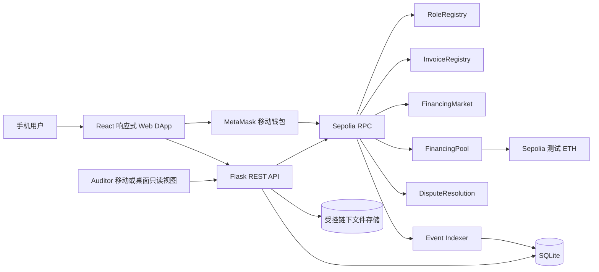
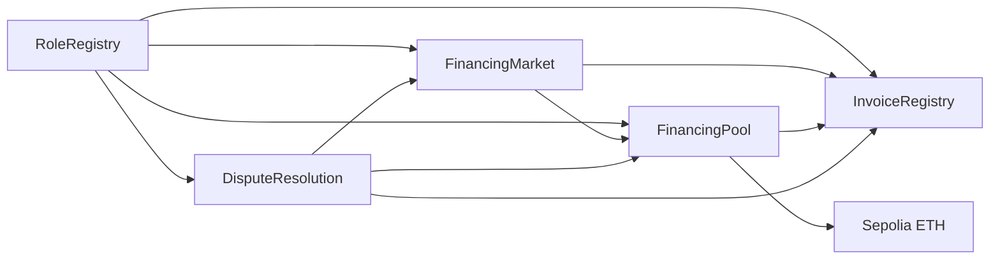
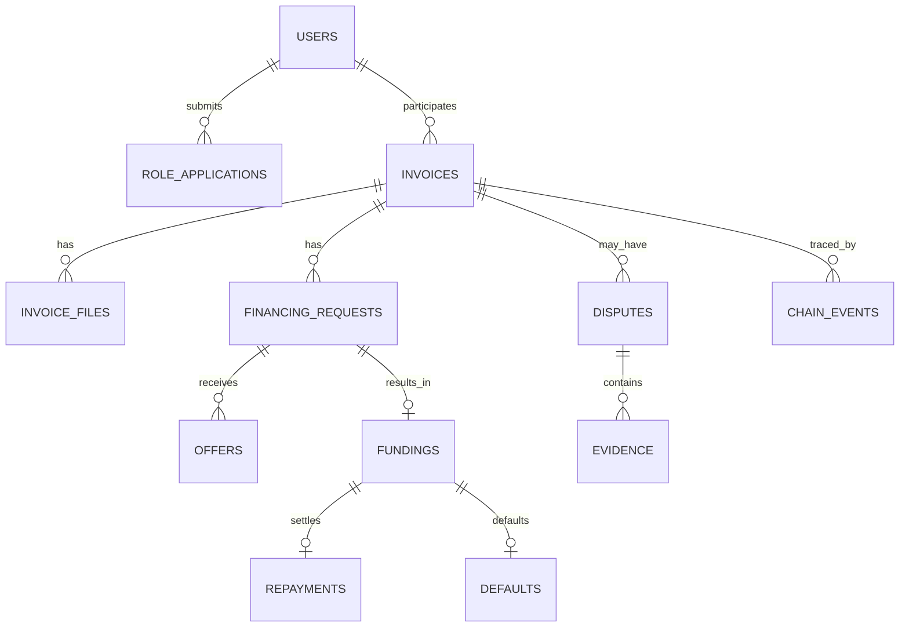

# SC6113 项目作业要求映射与交付清单

> 项目：中小企业已确认应收账款单笔融资 DApp　|　主端：英文移动端响应式 Web　|　钱包：MetaMask　|　网络：Sepolia

## 1. 项目问题与验证边界

目标用户是持有已确认应收账款、希望在 Buyer 到期付款前获得流动性的 Supplier；Buyer、Funder、Arbitrator、Auditor 和 Admin 是直接参与或监督的利益相关方。方案要求 Buyer 先确认发票，随后由单一 Funder 报价、放款，Buyer 一次性还款，合约按预定规则分配资金。不可转让 Invoice NFT 用于防止**本系统内**同一发票重复融资；链上哈希和 Buyer 签名并不能独立证明线下发票真实或具有可执行的法律债权。

问题的宏观背景可引用 [IFC 的 MSME 融资缺口说明](https://www.ifc.org/en/what-we-do/sector-expertise/financial-institutions/msme-finance)。[ADB 2025 全球贸易融资缺口调查](https://www.adb.org/publications/adb-global-trade-finance-gap-survey)估计全球贸易融资缺口为 2.5 万亿美元，但这是进出口贸易融资的未满足需求，**不能直接当作本项目目标市场的应收账款融资缺口**。最终技术报告还需要加入与目标用户、目标地区或同类流程直接相关的数据、访谈或情景验证，记录样本、方法和局限。

区块链适用点是让 Supplier、Buyer、Funder 与 Auditor 共享可核对的状态、事件和托管分账规则；相较由单一平台维护的数据库，参与方可独立验证关键资金动作。链下文件、身份核验、发票真实性、争议证据和法律追索仍依赖机构与现实流程，须在可行性讨论中说明。

## 2. 系统架构图

部署图中的云服务器建议用 Nginx 提供前端静态资源并代理 Gunicorn/Flask；索引器作为独立进程运行，数据库和文件存储需要持久化与备份。该图是目标架构，不代表当前已部署。演示和报告须提供公开 URL、实际 Sepolia 合约地址、部署区块、编译器与优化配置、ABI 版本和可验证交易链接。

技术选型直接沿用总体设计：Solidity `^0.8.20`、OpenZeppelin Contracts、Remix IDE；MetaMask 与 Ethers.js 6；React 19、Vite 8、Mantine 9；Python、Flask、Flask-SQLAlchemy、SQLite；Remix Solidity Unit Testing、Pytest；云服务器、Nginx、Gunicorn；Git 与 GitHub。技术小版本、合约编译器优化参数和部署地址在实现后记录。实际 UI 文案全部为英文。

## 3. 合约交互与数据模型

`InvoiceRegistry` 是发票状态的唯一写入入口。`DisputeResolution` 独立记录争议状态及冻结标识。至少五份业务合约有明确交互，满足课程“至少三份交互合约”的设计要求；实现后应以部署地址、ABI、合约调用测试和 Sepolia 交易为证据。

SQLite 保存查询镜像、元数据和事件索引；金额以高精度整数或十进制字符串保存。文件原文存链下，链上只存哈希和关键业务状态。索引唯一键为 `chainId + txHash + logIndex`，重扫时按链上事件修复镜像。完整流程和状态图见[总体设计文档](设计文档.md)第 7–9 节；页面与接口分别见[UI 设计文档](UI设计文档.md)和[API 设计文档](API设计文档.md)。

## 4. 作业要求对照

| 作业要求 | 本项目设计对应 | 最终应提交的证据 |
|---|---|---|
| 真实问题、用户与利益相关方 | Supplier 提前融资；Buyer 确认；Funder 出资；Arbitrator 裁决；Auditor 审计 | 有来源的目标地区/用户数据、访谈或场景测试、痛点与现有方案比较 |
| 至少三种角色与权限认证 | 六类角色；钱包签名登录；RoleRegistry 多角色与业务利益冲突检查 | 登录与拒权测试、Admin 审核记录、角色切换演示 |
| MetaMask 集成与安全签名 | 手机主端连接 MetaMask；所有业务写操作由钱包签名 | 手机录屏、Sepolia 钱包与交易哈希、错网/拒签演示 |
| 至少三份交互合约 | RoleRegistry、InvoiceRegistry、FinancingMarket、FinancingPool、DisputeResolution | 合约源码、部署地址、调用关系测试 |
| 至少十类链上交易 | `requestRole` 至 `resolveDispute` 等至少 18 类核心业务交易 | 函数清单、测试记录和代表性 Sepolia 交易哈希 |
| REST API、持久化与异常处理 | Flask API、SQLite、文件服务、交易验证、事件索引 | API 文档、接口测试、数据库迁移、异常响应示例 |
| 响应式仪表盘、历史、事件与可视化 | 移动端角色首页、交易记录、审计摘要与事件时间线 | 320/375/430 px 截图、交互测试、Auditor 只读演示 |
| Gas 估算与优化 | 哈希上链、整数计算、结构体布局、操作成本比较 | 各核心函数的 Gas 实测、正常流程总成本、优化前后分析 |
| 安全与测试 | 权限、重入、重复放款/还款、状态机、资金守恒、索引幂等 | 合约/API/端到端测试报告，含失败场景与覆盖范围 |
| 公有云部署 | 前端、API、索引器、数据库和受控文件存储 | 可公开访问 URL、部署架构、健康检查、日志、备份说明 |
| 影响与可行性评估 | 处理时间、融资可得性、透明度、用户操作成功率 | 基线、样本、测量方法、结果与局限；不要把测试网交易量当真实影响 |
| 报告、演示与贡献 | 10–15 页技术报告、幻灯片、10 分钟演示、用户手册、个人贡献 | 完整文档、演示视频/现场脚本、Git 提交与分工记录 |

## 5. 建议的可测量指标

| 指标 | 测量方式 | 报告中需要补充 |
|---|---|---|
| 任务完成率 | 按角色完成“建票—确认—融资—放款—还款”的人数 / 尝试人数 | 测试人数、设备、任务脚本、失败原因 |
| 流程耗时 | 从 Supplier 发起登记到 Buyer 确认、Funder 放款、最终结算分别计时 | 中位数、范围、链上确认等待与人工等待拆分 |
| 成本 | 每类核心交易与完整流程的 Gas、测试网 ETH 单价换算 | Gas 测量环境、编译器与优化参数、时间点 |
| 可审计性 | 随机抽样交易中，能从审计时间线追溯到链上事件和资金去向的比例 | 抽样方法、差异项、索引延迟 |
| 安全闭环 | 正常、拒绝、过期、放款超时、争议、违约路径的状态与资金守恒检查 | 测试用例、断言、失败记录 |
| 易用性 | 手机端任务完成率、误操作次数与简短用户反馈 | 受访者角色、测试环境、原始匿名反馈 |

这些是拟采用的指标定义，不是已取得的实验结果。最终报告应明确基线与对照；若没有真实机构数据，只能报告原型和情景评估结果。

## 6. 实际约束与扩展评估

课程要求讨论安全、扩展性、伦理、法规和采用障碍。当前方案只用 Sepolia 测试 ETH 验证技术闭环，不能处理真实资金或债权。Buyer 的链上确认仍依赖链下身份核验和文件真实性审查；链上公开地址、金额、时间和事件可能泄露商业关系，因此原始发票与证据须限制访问，公开演示只使用脱敏或合成材料。真实部署前还需评估适用地区的应收账款转让、电子签名、数据保护、反洗钱、支付与信贷监管要求，并确定争议裁决和法律追索主体。

SQLite 与单实例索引器适合课程原型，不能直接证明企业级吞吐、故障恢复或多租户隔离。评估时记录 API 读请求的延迟、索引追块滞后、RPC 故障恢复时间与并发用户数；若面向真实机构扩展，应评估托管数据库、任务队列、备份恢复、RPC 冗余、密钥与合约治理。采用障碍还包括用户持有测试/真实 Gas、手机钱包操作复杂度、交易确认延迟、机构对链上数据和资金托管的接受度。

## 7. 交付顺序与待填写信息

1. 锁定 payable 合约接口、`msg.value` 校验、部署配置、角色与阶段权限；据此同步 UI 和 API 字段。
2. 实现五份业务合约、前后端、SQLite 迁移和事件索引；保留测试与 Git 贡献记录。
3. 在 Sepolia 部署并记录：公开 URL、合约地址、部署交易、起始区块、ABI、编译器、优化参数、RPC 与确认策略。
4. 用真实手机完成正常流程和至少十二个异常/争议场景；采集 Gas、性能、可用性与审计追溯数据。
5. 编写 10–15 页技术报告与用户手册，准备幻灯片和 10 分钟演示，附上实际证据与局限。

当前仓库只有设计资料；上述部署、测试、用户验证和报告证据需要在实现阶段填写。不得把本文件中的目标架构、占位信息或建议指标写成已实现结果。

## 8. 演示结算资产与测试

**SC6113 作业没有要求 MockUSD 或任何 ERC-20。**为了控制作业范围，当前设计改用 Sepolia 测试 ETH 完成放款、Holdback、还款和分账。核心业务合约仍为五份，链上业务交易类型仍超过十类。测试 ETH 既是结算资产，也是支付 Gas 的资产；演示钱包须保留高于交易金额的余额。票面金额和融资金额是合成的测试 ETH 数值，不应被解释为真实发票的美元金额或真实债权。

Funder 调用 payable `fundFinancing` 时必须发送恰好 `P` wei；Buyer 调用 payable `repayInvoice` 时必须发送恰好 `V` wei。演示需要核对 Supplier 首笔到账 `P-R`、池内 Holdback `R`、Buyer 还款、Funder 本息、平台费、Supplier 尾款，以及违约时的 Holdback 返还。每笔资金动作都记录交易哈希、事件和前后余额；Gas 消耗单独列示，不计入 `P`、`V` 或分账公式。

先在 Remix Solidity Unit Testing 中检查精确 `msg.value`、少付/多付回滚、外部 ETH 转账失败、重入、重复放款/还款和资金守恒，再在 Sepolia 用 MetaMask 做正常端到端演示。24 小时放款超时和宽限期等时间场景适合在单元测试中控制时间，无需为了演示等待真实天数。[Ethereum 官方网络文档](https://ethereum.org/developers/docs/networks/)列出 Sepolia 及测试 ETH 获取途径；[OpenZeppelin 的 ReentrancyGuard 文档](https://docs.openzeppelin.com/contracts/5.x/api/utils)可作为 ETH 转出安全设计参考。
