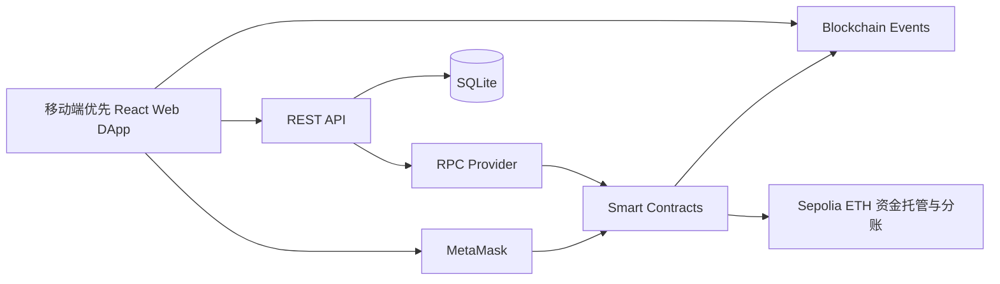
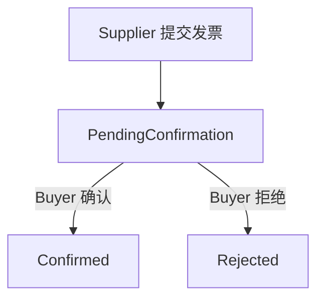
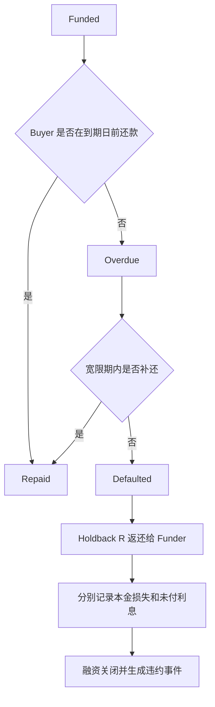
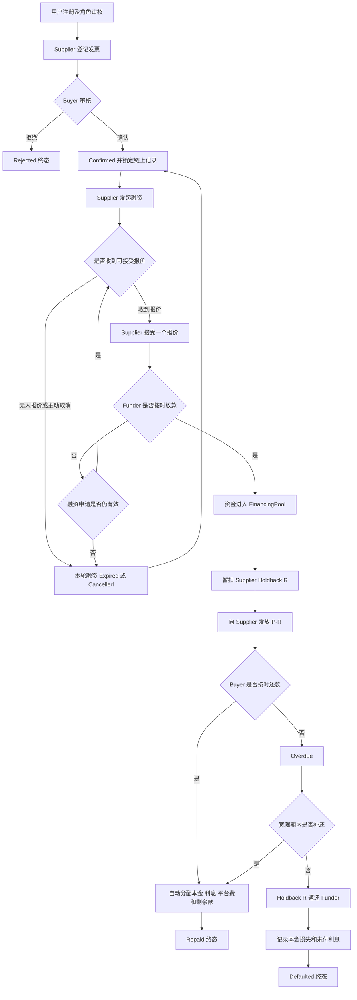
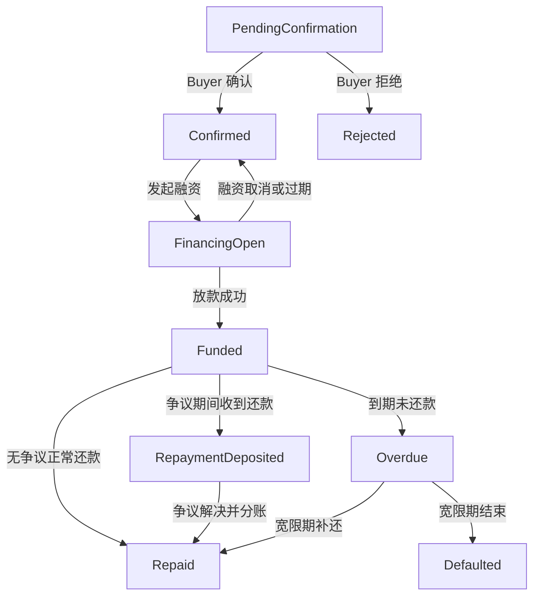
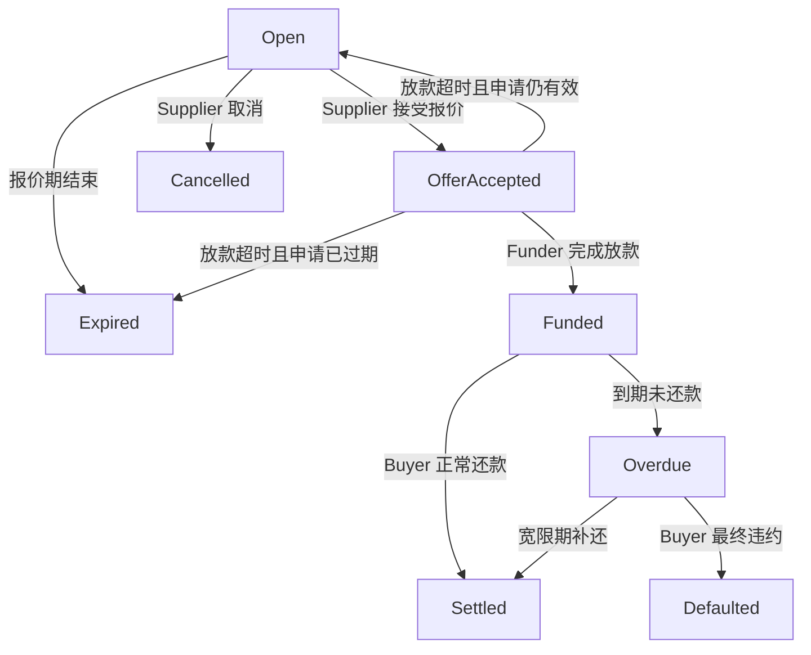
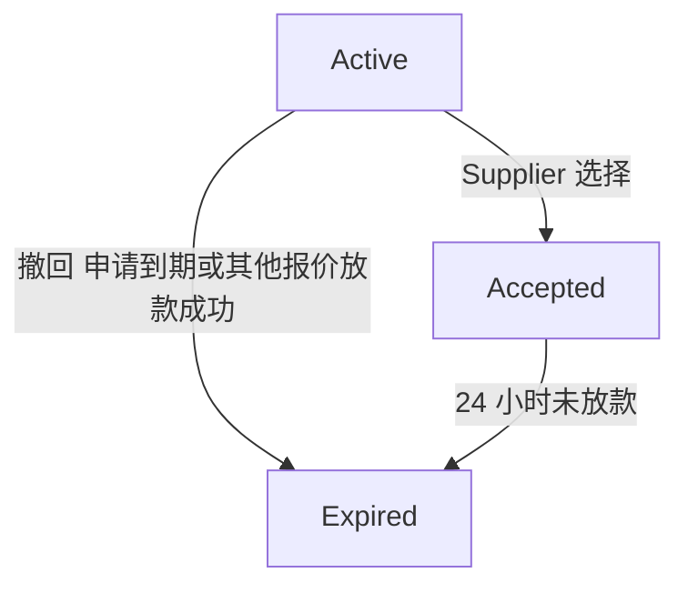
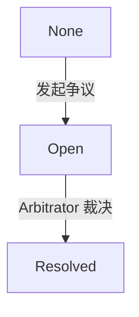
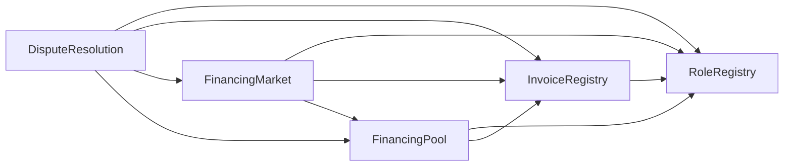

# blockchain-sme-receivables-financing 设计文档

`blockchain-sme-receivables-financing` 是面向中小企业已确认应收账款的单笔融资与审计 DApp。核心范围限定为已确认发票、单笔融资、单一 Funder、固定利率和一次性还款。

## 1 设计结论

本系统的业务流程在加入发票拒绝、融资申请过期、报价撤回、放款超时、逾期还款、违约结算和分阶段争议处理后，可以形成完整闭环。

系统闭环的判断标准如下：

1. 每一张已进入业务流程的发票都能到达明确状态，包括 `Rejected`、`Confirmed`、`Repaid` 或 `Defaulted`。
2. 每一个融资申请都能到达 `Cancelled`、`Expired`、`Settled` 或 `Defaulted` 终态；`Funded` 是放款后的中间状态。
3. 每一个报价都只处于 `Active`、`Accepted` 或 `Expired` 之一，放款结果由融资申请状态记录。
4. 所有进入合约的资金在终态时都有明确去向，不留下无法处理的余额。
5. 所有争议都只能执行预先定义的裁决结果，裁决后恢复原流程或进入终态。
6. 所有核心状态变化都产生链上事件，Auditor 通过前端实时读取合约状态和事件。

本系统是测试网教学原型，不处理真实发票、真实法币或真实法律债权，也不宣称链上记录能够独立证明发票真实性。

## 2 项目目标

本项目针对中小企业供应商在提供商品或服务后，需要等待买方到期付款而产生的流动性问题。供应商可以使用一张已经由 Buyer 确认的应收账款申请提前融资，由 Funder 提供资金；Buyer 到期还款后，智能合约自动完成本金、利息、平台费和剩余款项的分配。

系统目标包括：

- 通过 Buyer 钱包确认减少虚假发票融资风险。
- 使用唯一且不可修改的链上发票记录防止系统内重复融资。
- 使用智能合约公开执行报价、放款、还款和分账规则。
- 为 Funder 提供清晰的融资状态、预期收益和违约记录。
- 为 Auditor 提供不可篡改的事件时间线和资金流向。
- 对拒绝、取消、超时、争议和违约建立明确终态。

## 3 业务范围

- 钱包连接和签名登录。
- 钱包签名登录、角色申请和 Admin 审核。
- Supplier 登记发票元数据和文档哈希。
- Buyer 确认或拒绝应付账款。
- Buyer 确认后锁定唯一链上发票记录。
- Supplier 发起单笔融资申请。
- 多个 Funder 提交报价，但 Supplier 只能接受一个报价。
- 被选中的 Funder 在规定时间内完成全额放款。
- FinancingPool 托管放款、Supplier Holdback 和还款资金。
- Buyer 到期主动还款。
- 智能合约自动计算和分配资金。
- 逾期、宽限期、违约及损失记录。
- 基于阶段和权限的争议处理。
- 基于实时链上状态与事件的 Auditor 只读审计面板。

## 4 角色与模块

### 4.1 系统角色与权限

| 角色 | 主要职责 | 禁止操作 |
|---|---|---|
| Supplier | 登记发票、申请融资、接受报价、提交证据 | 不能确认自己的发票，不能决定争议结果 |
| Buyer | 确认或拒绝发票、到期还款、提交证据 | 不能修改 Supplier 的融资报价，不能提取融资资金 |
| Funder | 查看已确认发票、提交或撤回报价、完成放款、提交证据 | 不能修改发票内容，不能自行执行分账 |
| Arbitrator | 查看争议与证据哈希、执行预定义裁决 | 不能创建发票、报价、融资或提取平台资金 |
| Auditor | 查看事件、资金流、状态变化和审计报表 | 无任何业务写权限 |
| Admin | 批准或撤销参与者角色 | 不参与融资选择，不负责争议裁决 |

角色绑定到钱包地址，同一地址可以拥有多个角色，RoleRegistry 使用多角色映射而不是单一角色枚举。Admin 管理角色，Arbitrator 负责争议，Auditor 保持只读；具体业务仍按参与方地址和合约状态检查权限。

单笔业务必须执行利益冲突检查：Supplier 与 Buyer 必须是不同地址；Funder 不能是该发票的 Supplier；Arbitrator 不能是该笔业务的 Supplier、Buyer 或 Funder。Admin 可以撤销角色；既有业务仍按合约保存的参与方地址完成确认、放款、还款或证据提交。

### 4.2 模块与功能点

| 模块 | 核心功能点 | 主要角色 | 核心合约或服务 |
|---|---|---|---|
| 用户与角色 | 钱包签名登录、角色申请、Admin 审核、多角色和利益冲突检查 | 所有角色、Admin | RoleRegistry、Auth Service |
| 发票管理 | 发票登记、文件哈希、Buyer 确认或拒绝、锁定唯一记录、防重复融资 | Supplier、Buyer | InvoiceRegistry |
| 融资申请 | 创建、取消和过期单笔融资申请，设置本金、最高利率和期限 | Supplier | FinancingMarket |
| 报价管理 | Funder 报价、撤回、过期，Supplier 选择唯一报价 | Supplier、Funder | FinancingMarket |
| 放款管理 | 校验选中 Funder、全额放款、暂扣 Holdback、向 Supplier 支付净融资款 | Funder、Supplier | FinancingPool |
| 还款与分账 | Buyer 一次性还款，自动分配本金、利息、平台费和 Supplier 剩余款 | Buyer、Funder、Supplier | FinancingPool |
| 逾期与违约 | 到期检查、宽限期、Holdback 返还、本金损失和未付利息记录 | Buyer、Funder | FinancingPool |
| 争议处理 | 发起争议、提交证据哈希、冻结操作、预定义裁决和恢复流程 | Supplier、Buyer、Funder、Arbitrator | DisputeResolution |
| 事件与审计 | 交易验证、实时事件读取、交易历史、发票资金流和只读审计时间线 | Auditor | Ethers.js、RPC、REST API |
| 前端展示 | 按角色显示待办、发票、报价、资金、争议和交易状态 | 所有角色 | React Web DApp |

## 5 总体架构与技术选型

### 5.1 总体架构



系统遵循以下职责划分：

- 区块链保存角色、发票唯一标识、核心状态、资金和裁决结果。
- SQLite 只保存登录 Nonce、登录会话、发票编号元数据和已验证交易记录，不保存链上业务状态镜像。
- 当前版本不保存原始合同、发票或证据文件；链上只保存文档哈希或证据哈希。
- 后端通过 RPC 验证交易回执、发送者和目标合约；建票绑定时额外验证 `InvoiceSubmitted` 事件，不信任前端自行声明交易成功。
- 前端负责业务交互，但所有权限和状态检查最终由智能合约执行。
- 教学原型的发票票面金额、本金、Holdback、利息和平台费均以 Sepolia 测试 ETH 计价，链上按 wei 整数处理。它们不代表真实法币债权金额。

### 5.2 技术选型

| Layer | Technology | Purpose |
|---|---|---|
| Blockchain | Ethereum Sepolia | Test transactions, contract state and events |
| Smart Contract | Solidity `^0.8.20`, OpenZeppelin Contracts | Roles, invoice state, financing, transfers, repayment and disputes |
| Contract Tooling | Remix IDE | Compile, deploy, inspect contracts and generate ABI |
| Wallet and Web3 | MetaMask, Ethers.js 6 | Wallet connection, signing, contract calls and receipts |
| Frontend | React 19, Vite 8, Mantine 9 | 移动端优先的响应式页面、表单、仪表盘和交易反馈 |
| Backend | Python, Flask, Flask-SQLAlchemy | Wallet authentication, metadata, live RPC queries and transaction verification |
| Database | SQLite | Nonces, sessions, invoice metadata and verified transaction history |
| Testing | Pytest, ESLint, TypeScript, Vite build | Backend tests and frontend static/build verification |
| Deployment | Local Flask and Vite services | Six-minute demonstration runtime |
| Version Control | Git, GitHub | Source control, documentation and contribution history |

实际编译器小版本和优化参数在实现后记录到构建元数据中，不在设计阶段预先写死。

## 6 模块设计

### 6.1 钱包身份与角色审核模块

#### 目标

建立钱包身份与业务角色之间的映射，确保只有经过审核的用户可以进入相应业务流程。

#### 正常流程

1. 用户连接 MetaMask。
2. 后端生成一次性登录 Nonce。
3. 用户签名 Nonce，后端验证签名并建立会话。
4. 用户申请 Supplier、Buyer、Funder、Arbitrator 或 Auditor 角色。
5. Admin 审核角色申请。
6. 审核通过后，Admin 调用 `approveRole` 写入 RoleRegistry。
7. 前端重新读取 RoleRegistry，并把角色显示为 Active。

#### 角色状态

- 尚未申请：Inactive。
- 已申请、等待 Admin：Pending。
- Admin 已批准：Active。
- Admin 调用 `revokeRole` 后：Inactive。

#### 关键规则

- 即使钱包同时拥有 Admin 和 Arbitrator，合约仍禁止其裁决自己作为 Supplier、Buyer 或 Funder 参与的业务。
- Auditor 始终保持只读。
- RoleRegistry 支持一个钱包拥有多个已审核角色。
- 每笔业务单独检查参与方地址冲突，不能只依赖全局角色。
- 角色被撤销后，不能再执行要求该角色的后续操作。
- 登录 Nonce 只能使用一次，并设置过期时间，防止签名重放。

### 6.2 发票登记与 Buyer 确认模块

#### 目标

只有 Buyer 明确确认的应收账款才能进入融资流程。

#### 正常流程

1. Supplier 输入 Buyer 地址、发票号码、票面金额、签发日、到期日和文件哈希。
2. InvoiceRegistry 计算唯一 `invoiceKey`，检查系统内没有重复记录。
3. 发票进入 `PendingConfirmation`。
4. Buyer 核对页面中的发票元数据和文档哈希，并选择确认或拒绝。
5. Buyer 确认后，发票进入 `Confirmed`。
6. InvoiceRegistry 锁定该发票的核心字段，不允许后续修改。
7. 后端验证提交交易，并把发票编号元数据绑定到链上 Invoice ID。

#### 确认与拒绝流程



#### 关键规则

- `invoiceKey` 建议由 Buyer、Supplier、发票号码、签发日期和链 ID 共同计算。
- 链上 Invoice ID 只代表系统内的一条已确认记录，不代表法律上的债权凭证。
- 发票核心字段确认后不可修改，且同一发票同时只能存在一个活跃融资申请。
- Buyer 确认后，Supplier 不能修改票面金额、Buyer、到期日和文件哈希。
- 每张发票同时只能存在一个活跃融资申请。

### 6.3 融资申请模块

#### 目标

允许 Supplier 针对一张已确认且未融资的发票申请一次融资。

#### Supplier 输入

- 申请融资本金 `P`。
- 可接受的最高年化利率 `maxRateBps`。
- 融资申请截止时间 `financingDeadline`。
- Supplier Holdback 比例 `holdbackBps`。

#### 正常流程

1. Supplier 对 `Confirmed` 发票调用 `openFinancing`。
2. 合约验证 `P` 不超过允许的票面金额比例。
3. 发票进入 `FinancingOpen`。
4. 融资申请进入 `Open`。
5. Funder 可以在融资申请截止前提交报价。

#### 取消和过期

- Supplier 在接受报价前可调用 `cancelFinancing`，申请进入 `Cancelled`。
- 融资申请截止后无人被选择，任何人可调用 `expireFinancing`，申请进入 `Expired`。
- `Cancelled` 或 `Expired` 后，发票回到 `Confirmed`，可重新发起一次新的融资申请。

### 6.4 Funder 报价模块

#### 目标

允许多个 Funder 提交可比较报价，但最终只选择一个 Funder。

#### 报价内容

- Funder 钱包地址。
- 全额融资本金。
- 年化利率基点 `rateBps`。

#### 正常流程

1. Funder 调用 `submitOffer`。
2. 合约检查报价利率不超过 Supplier 的最高利率。
3. Supplier 选择一个有效报价并调用 `acceptOffer`。
4. 被选择报价进入 `Accepted`。
5. 其他未过期报价暂时保持 `Active`，作为放款超时后的备选。
6. 被选中的 Funder 必须在报价接受后的 24 小时内调用 `fundFinancing`。
7. 放款成功后，其他 `Active` 报价统一进入 `Expired`。

#### 异常出口

- 报价被接受前，Funder 可调用 `withdrawOffer`，该报价直接进入 `Expired`。
- 融资申请截止后，所有未被接受的 `Active` 报价进入 `Expired`。
- 被接受的 Funder 在 24 小时内未放款，该报价进入 `Expired`。
- 如果融资申请仍在有效期内，申请从 `OfferAccepted` 回到 `Open`，Supplier 可以选择其他 `Active` 报价。
- 如果融资申请已经过期，本轮融资进入 `Expired`，Supplier 需要重新发起融资申请。

报价必须在 `financingDeadline` 前被接受。报价一旦按时被接受，被选中的 Funder 仍拥有完整的 24 小时放款窗口，即使该窗口结束时间晚于 `financingDeadline`；但融资申请截止后不再接收新报价。

报价阶段不锁定 Funder 资金，避免多个 Funder 的资金同时被长期占用。

### 6.5 放款与 Supplier Holdback 模块

#### 目标

确保 Funder 的资金通过 FinancingPool 按预定规则进入 Supplier，并从融资款中暂扣一部分 Supplier Holdback。Holdback 是尚未发放给 Supplier 的融资款，不是 Supplier 额外缴纳的保证金，也不能保证 Funder 在违约时收回全部本金。

#### 正常流程

1. 被选中的 Funder 在 MetaMask 中确认 `fundFinancing` 交易及其 ETH 转账金额。
2. Funder 调用 payable `fundFinancing`，并使 `msg.value == P`；少付或多付均回滚。
3. 合约计算 Supplier Holdback 金额 `R`。
4. FinancingPool 将 `P - R` 转给 Supplier。
5. `R` 留存在 FinancingPool 中。
6. 融资状态进入 `Funded`，发票状态进入 `Funded`。
7. 合约记录融资时间、到期日和预期利息。

#### 计算公式

```text
R = P × holdbackBps ÷ 10000

I = P × rateBps × financingDays ÷ 10000 ÷ 365

SupplierUpfront = P - R
```

其中：

- `P` 为 Funder 提供的融资本金。
- `R` 为从融资款中暂扣、尚未发放给 Supplier 的 Holdback。
- `I` 为到期时 Funder 应取得的简单利息。
- 所有金额使用 wei 整数计算；页面按 ETH 显示。

#### 安全规则

- 只有报价中被选中的 Funder 可以放款。
- Funder 必须一次性提供完整本金，不支持部分放款。
- 实际放款时间必须早于发票到期时间。
- `financingDays = ceil((invoiceDueAt - fundedAt) / 1 day)`，实际放款时锁定利息金额。
- Buyer 提前还款仍按照已经锁定的利息结算，不重新计算实际使用天数。
- 状态先更新，再通过受检查的 ETH `call` 执行外部转账；任意转账失败则整笔交易回滚。
- 使用 `ReentrancyGuard` 和 Checks Effects Interactions 顺序，防止 ETH 转账时重入。
- 放款完成后，同一发票不能再次融资。

### 6.6 Buyer 到期还款与自动分账模块

#### 目标

Buyer 支付发票票面金额后，智能合约自动完成所有参与方的分账。

#### 正常流程

1. Buyer 在 MetaMask 中核对票面金额 `V` 与额外 Gas 预算。
2. Buyer 调用 payable `repayInvoice`，并使 `msg.value == V`；少付或多付均回滚。
3. 如果没有争议，`repayInvoice` 在同一笔交易中完成分账，不再要求额外调用公开的 `settleRepayment`。
4. 如果当前存在争议，还款资金保留在池中，发票进入 `RepaymentDeposited`，等待争议解决。
5. 争议解决后，任何地址都可以调用无自由参数的 `finalizeSettlement`，按照已经锁定的规则完成分账。
6. Funder 获得本金 `P` 和利息 `I`。
7. 平台地址获得平台费 `F`。
8. Supplier 获得剩余金额以及正常情况下释放的 Holdback 价值。
9. 发票进入 `Repaid`，融资进入 `Settled`。
10. 对应链上发票记录被标记为已结算，不允许再次融资。

`RepaymentDeposited` 状态禁止 Buyer 再次还款，也禁止在争议解决前执行普通分账。

#### 分账公式

```text
F = P × platformFeeBps ÷ 10000

FunderPayment = P + I

SupplierFinalPayment = V + R - P - I - F
```

合约在接受报价时必须验证：

```text
V + R >= P + I + F
```

如果不满足该条件，报价不能被接受。

#### 终态资金检查

进入 `Repaid` 后，该发票对应的合约余额必须为零：

```text
Contract Inflow  = P + V
Contract Outflow = SupplierUpfront + FunderPayment + PlatformFee + SupplierFinalPayment
```

### 6.7 逾期和违约模块

#### 目标

解决 Buyer 未按时还款时业务无限停留在 `Funded` 的问题。

#### 流程



#### 违约结算

1. 到期后，任何授权参与方可调用 `markOverdue`。
2. 宽限期结束后仍未还款，可调用 `declareDefault`。
3. FinancingPool 将尚未发放给 Supplier 的 Holdback `R` 返还给 Funder。
4. 合约分别记录本金损失、未付利息和总未偿敞口。
5. 发票进入 `Defaulted`，融资进入 `Defaulted`。
6. 链上发票记录标记为违约终态。

```text
PrincipalLoss = P - R

UnpaidInterest = I

TotalUnpaidExposure = PrincipalLoss + UnpaidInterest
```

这些数值是审计记录，不代表智能合约可以从 Buyer 钱包强制扣款。真实催收和法律追索不在本项目范围内。本原型把 `Defaulted` 视为终态，不处理违约后的迟延回收。

进入 `Defaulted` 后，该发票对应的合约余额也必须为零。

### 6.8 争议处理模块

#### 目标

在不赋予 Arbitrator 任意资金控制权的前提下，处理发票、融资和还款阶段的争议。

#### 发起条件

- Supplier、Buyer 或本次融资的 Funder 可以发起争议。
- 只有已经确认且尚未进入终态的发票可以发起争议。
- 终态发票不能再次发起争议。
- 同一发票同时只能存在一个未解决争议。
- 发起方提交争议原因哈希。

#### 争议流程

1. 发起方调用 `openDispute`。
2. 系统保持原发票状态不变，将独立的 `disputeStatus` 设为 `Open`，并将 `operationsFrozen` 设为 `true`。
3. 相关参与方调用 `submitEvidenceHash` 提交证据哈希。
4. Arbitrator 查看链上原因哈希、证据哈希、提交人和时间。
5. Arbitrator 只能选择 `RESUME`、`CANCEL` 或 `CONFIRM_DEFAULT`。
6. DisputeResolution 调用 InvoiceRegistry、FinancingMarket 或 FinancingPool 执行裁决。
7. 争议进入 `Resolved` 并解除冻结，业务按裁决结果继续或进入终态。
8. 发票业务状态恢复流转，或进入取消、偿还、违约等明确终态。

#### 裁决类型

| 裁决 | 允许阶段 | 结果 |
|---|---|---|
| `RESUME` | 任意非终态 | 解除冻结并恢复原流程；如果已经收到还款，则进入正常分账 |
| `CANCEL` | 放款前 | 取消本轮融资，所有报价进入 `Expired`，发票回到 `Confirmed` |
| `CONFIRM_DEFAULT` | `Funded` 或 `Overdue` | 返还 Holdback，分别记录本金损失和未付利息，进入 `Defaulted` |

裁决必须与当前业务阶段兼容。Arbitrator 无权追回已经转到外部钱包的资金，也无权输入任意收款地址或任意转账金额。`Resolved` 只是争议记录的终态，不是发票终态。

### 6.9 链上事件与审计模块

#### 目标

直接读取合约状态和关键事件，形成只读审计时间线和资金统计。

#### 流程

1. 每个核心操作发出包含业务 ID、参与方、金额和状态的事件。
2. 前端通过 RPC 读取五个合约的当前状态。
3. Auditor 页面从合约部署区块开始分段扫描事件日志，并在浏览器内整理时间线。
4. Auditor 通过 Dashboard 查看只读汇总、资金流和事件。
5. 交易哈希可跳转 Etherscan 进行独立核对。

#### Auditor 可查看

- 发票及融资状态分布。
- 当前锁定金额和累计放款金额。
- 正常还款、逾期和违约记录。
- Funder 本金和收益。
- Supplier 实际收到金额。
- 平台费。
- 争议数量、状态和处理时间。
- 单张发票的完整事件时间线。
- 每笔交易的哈希、区块号和发送者。

Auditor 不持有任何写权限，不能通过前端或合约修改业务数据。

## 7 完整业务闭环



争议可以在非终态阶段通过独立的 `disputeStatus` 和 `operationsFrozen` 冻结相应流程，不覆盖发票业务状态。争议解决后，系统必须恢复原流程、把发票退回 `Confirmed`，或者进入 `Repaid` 或 `Defaulted`。

## 8 状态机设计

### 8.1 发票状态



`RepaymentDeposited` 仅用于 Buyer 已付款但因争议尚未完成分账的情况。争议状态由独立的 `DisputeStatus` 保存，不写入 `InvoiceStatus`。

终态为：`Rejected`、`Repaid`、`Defaulted`。

### 8.2 融资申请状态



### 8.3 报价状态



选中报价放款成功后保持 `Accepted`，融资申请状态进入 `Funded`；是否完成放款由融资申请记录，不再增加报价状态。

### 8.4 争议状态



证据可以在 `Open` 状态下多次提交，不再为证据提交和审核分别增加争议状态。

## 9 智能合约模块

### 9.1 RoleRegistry

负责：

- 用户角色申请和审核结果。
- 钱包地址到角色的映射。
- 角色申请、批准、撤销和查询。
- 为其他合约提供权限检查。

### 9.2 InvoiceRegistry

负责：

- 发票登记和唯一性检查。
- Buyer 确认或拒绝。
- 保存唯一、不可修改的链上发票记录。
- 发票状态和核心文件哈希。
- 防止重复融资。
- 作为 `InvoiceStatus` 的唯一存储和修改入口。
- 只允许 FinancingMarket、FinancingPool 和 DisputeResolution 调用对应的受限状态转换函数。

### 9.3 FinancingMarket

负责：

- 融资申请创建、取消和过期。
- Funder 报价、撤回和过期。
- Supplier 接受唯一报价。
- 调用 FinancingPool 启动放款。
- 通过 InvoiceRegistry 的受限接口更新 `FinancingOpen` 等状态，不直接复制发票状态。

### 9.4 FinancingPool

负责：

- 接收 Funder 本金。
- 保留 Supplier Holdback。
- 向 Supplier 发放净融资款。
- 接收 Buyer 还款。
- 计算和执行正常分账。
- 逾期、违约、Holdback 返还和损失记录。
- 通过 InvoiceRegistry 的受限接口更新 `Funded`、`RepaymentDeposited`、`Repaid` 和 `Defaulted`。

### 9.5 DisputeResolution

负责：

- 创建争议。
- 保存证据哈希。
- 校验 Arbitrator 权限。
- 根据业务阶段限制可选裁决。
- 调用其他合约执行预定义裁决。
- 独立保存 `DisputeStatus` 和冻结标记，不覆盖 `InvoiceStatus`。

### 9.6 合约调用关系



InvoiceRegistry 是发票业务状态的唯一事实来源。部署时应一次性配置或通过严格的 Admin 初始化流程登记 FinancingMarket、FinancingPool 和 DisputeResolution 地址。普通钱包不能直接调用跨合约状态修改接口。

本作业原型使用 Sepolia 测试 ETH 作为演示结算资产，不部署 MockUSD 或其他 ERC-20。Funder 放款和 Buyer 还款通过 payable 合约调用携带 ETH，FinancingPool 按固定规则托管和转出 ETH。每个钱包须留出交易金额之外的测试 ETH 作为 Gas。课程没有规定结算资产；使用测试 ETH 可保留资金闭环并减少测试代币、发币和授权步骤。

## 10 链上交易类型

系统可以实现以下状态变更交易，满足至少十类链上交易的要求：

| 编号 | 交易 | 主要调用者 |
|---|---|---|
| 1 | `requestRole` | 所有用户 |
| 2 | `approveRole` | Admin |
| 3 | `submitInvoice` | Supplier |
| 4 | `confirmInvoice` | Buyer |
| 5 | `rejectInvoice` | Buyer |
| 6 | `openFinancing` | Supplier |
| 7 | `cancelFinancing` | Supplier |
| 8 | `submitOffer` | Funder |
| 9 | `withdrawOffer` | Funder |
| 10 | `acceptOffer` | Supplier |
| 11 | `fundFinancing` | Funder |
| 12 | `repayInvoice` | Buyer |
| 13 | `finalizeSettlement` | 争议解决后的任意调用者 |
| 14 | `markOverdue` | 授权参与方 |
| 15 | `declareDefault` | 授权参与方 |
| 16 | `openDispute` | Supplier Buyer Funder |
| 17 | `submitEvidenceHash` | 争议参与方 |
| 18 | `resolveDispute` | Arbitrator |

## 11 后端模块

### 11.1 钱包认证服务

- 生成一次性 Nonce。
- 验证 EIP-191 personal-sign 签名。
- 建立带过期时间的随机令牌会话，数据库只保存令牌哈希。
- 受保护接口验证会话；需要角色的接口再通过链上 RoleRegistry 校验。

### 11.2 交易验证服务

- 通过 RPC 查询交易回执。
- 验证目标合约地址、发送者和交易回执状态。
- 保存已确认交易的哈希、发送者、合约、动作、金额和区块号。
- 对提交发票交易解析 `InvoiceSubmitted` 事件，并校验元数据与链上记录一致后绑定 Invoice ID。
- 不接受前端提供的状态作为最终事实。

### 11.3 发票元数据服务

- 保存发票业务编号、Buyer、金额、日期和文档哈希。
- 创建元数据时检查 Supplier 登录身份、Buyer 角色、金额、日期和哈希格式；`invoiceKey` 唯一性由 InvoiceRegistry 在提交发票时保证。
- 交易确认后绑定链上 Invoice ID，避免发票编号与链上记录错配。
- Supplier 和指定 Buyer 可读取自己的相关元数据；Active Auditor 可读取全部元数据。

### 11.4 实时链上查询服务

- 通过 Sepolia RPC 查询发票、融资申请和报价。
- 根据登录钱包、角色和业务参与关系限制查询范围。
- 响应标记为 `live-rpc`，明确数据不是数据库镜像。
- 链上状态始终是业务事实来源。

## 12 数据库设计

当前版本使用 SQLite，数据表如下：

| 数据表 | 主要字段 |
|---|---|
| `wallet_nonce` | wallet_address nonce message expires_at used_at created_at |
| `auth_session` | wallet_address token_hash expires_at created_at |
| `invoice_metadata` | supplier buyer invoice_number face_value_wei issued_at due_at document_hash onchain_invoice_id submit_tx_hash |
| `transaction_record` | chain_id tx_hash wallet_address contract_name action value_wei status block_number created_at |

SQLite 不保存融资、报价、放款、还款、违约、争议或事件镜像。金额以 wei 字符串保存，禁止使用浮点类型。

## 13 REST API 设计

| Method | Endpoint | 功能 |
|---|---|---|
| GET | `/api/health` | 检查后端和 SQLite 状态 |
| GET | `/api/config` | 返回链 ID 和合约地址 |
| POST | `/api/auth/nonce` | 获取钱包登录 Nonce |
| POST | `/api/auth/verify` | 验证钱包签名 |
| GET | `/api/auth/me` | 查询当前登录钱包 |
| POST | `/api/invoices/metadata` | 保存并预校验发票元数据 |
| GET | `/api/invoices/metadata` | 按权限读取发票元数据 |
| GET | `/api/invoices` | 查询发票列表 |
| GET | `/api/invoices/{id}` | 查询发票完整详情 |
| GET | `/api/financing-requests` | 查询融资申请 |
| GET | `/api/financing-requests/{id}` | 查询融资申请详情 |
| GET | `/api/financing-requests/{id}/offers` | 查询报价 |
| POST | `/api/transactions/verify` | 验证交易并保存记录；建票时绑定 Invoice ID |
| GET | `/api/transactions` | 查询当前登录钱包的已验证交易 |

角色申请、争议和 Audit 事件时间线由前端直接调用或读取合约。后端业务接口不能代替用户签署链上金融交易。

## 14 前端模块

前端以手机上的响应式 Web DApp 为主端，优先适配 MetaMask 移动端浏览器；桌面布局用于审计、管理和辅助访问。所有实际界面文案使用英文，设计说明可使用中文。页面清单、交互状态和小屏线框见[UI 设计文档](UI设计文档.md)，REST 契约见[API 设计文档](API设计文档.md)。

### 14.1 公共模块

- MetaMask 连接和网络检查。
- 签名登录。
- 钱包地址、余额和角色显示。
- 交易等待、确认、失败和重试提示。
- Etherscan 交易链接。

### 14.2 Supplier Dashboard

- 待 Buyer 确认发票。
- 已确认可融资发票。
- 活跃融资申请和报价比较。
- 已放款、待还款和已结算融资。
- Supplier 实际收款和 Holdback。
- 需要提交证据的争议。

### 14.3 Buyer Dashboard

- 待确认或拒绝发票。
- 到期日和待还款金额。
- 逾期预警。
- 已还款和拒绝记录。
- 需要提交证据的争议。

### 14.4 Funder Dashboard

- 可报价融资申请。
- 活跃报价和报价结果。
- 待执行放款。
- 本金、预期利息和已实现收益。
- 逾期、违约、本金损失和未付利息。

### 14.5 Arbitrator Dashboard

- 待处理争议。
- 当前业务阶段。
- 原因哈希、证据哈希、提交人和时间。
- 当前阶段允许的裁决选项。
- 已完成裁决时间线。

### 14.6 Auditor Dashboard

- 发票、融资、还款、逾期和违约的基础统计卡片。
- 单张发票资金流和事件时间线。
- 交易哈希、区块号、发送者和事件类型筛选。

## 15 安全设计

### 15.1 智能合约安全

- 使用基于角色的访问控制。
- 使用 `ReentrancyGuard` 防止重入。
- payable 入口严格校验 `msg.value`；ETH 转出使用受检查的 `call`，失败时整笔回滚。
- 遵守 Checks Effects Interactions 顺序。
- 禁止重复放款、重复还款和重复分账。
- 严格校验状态转换。
- 对利率、期限、平台费和 Holdback 比例设置上限。
- 禁止 Arbitrator 输入任意转账地址和任意金额。
- 发票核心字段确认后不可修改，终态后禁止重新融资。
- InvoiceRegistry 是发票状态的唯一写入入口，跨合约写函数仅允许已登记合约调用。

### 15.2 后端安全

- 钱包签名 Nonce 一次性使用并过期。
- 所有写接口进行会话、角色和资源归属验证。
- 使用参数化查询和数据库唯一约束。
- RPC 验证交易，不信任前端状态。
- API 使用统一错误响应，不在日志中记录私钥或会话令牌明文。
- 私钥不进入前端源码、后端或数据库。

### 15.3 业务安全

- Buyer 确认是允许融资的必要条件。
- 一张发票同时只能存在一个活跃融资。
- 报价接受后只有对应 Funder 可以放款。
- 还款只能由发票 Buyer 发起。
- 争议状态与发票状态独立保存，争议期间冻结相应资金动作。
- `RepaymentDeposited` 状态禁止重复还款和普通分账。
- Supplier、Buyer、Funder 和 Arbitrator 必须通过单笔业务利益冲突检查。
- 终态后禁止重新融资或修改核心字段。

## 16 异常处理与闭环检查

| 异常情况 | 处理方式 | 最终状态 | 是否残留锁定资金 |
|---|---|---|---|
| 角色申请尚未批准 | 保持 Pending，不能进入对应业务视图 | Role Pending | 否 |
| Buyer 拒绝发票 | 发票进入拒绝终态 | Invoice Rejected | 否 |
| 融资无人报价 | 到期关闭 | Financing Expired | 否 |
| Supplier 不接受报价 | 融资到期关闭 | Financing Expired | 否 |
| Funder 撤回报价 | 报价终止 | Offer Expired | 否 |
| Funder 未按时放款且申请仍有效 | 选中报价过期并重新选择 | Offer Expired 和 Financing Open | 否 |
| Funder 未按时放款且申请已过期 | 本轮融资结束 | Offer Expired 和 Financing Expired | 否 |
| ETH 金额不符或转账失败 | 整笔交易回滚 | 保持原状态 | 否 |
| Buyer 到期未还款 | 进入宽限期 | Overdue | 有 Holdback 仍受控 |
| Buyer 宽限期后仍未还款 | Holdback 返还并分别记录本金损失和未付利息 | Defaulted | 否 |
| Buyer 已还款但争议未解决 | 保留还款资金并禁止重复还款 | RepaymentDeposited | 有 还款资金仍受控 |
| 发生争议 | 设置独立争议状态并冻结相关动作 | Dispute Open | 资金继续由合约控制 |
| Arbitrator 完成裁决 | 解决争议并恢复流程或进入发票终态 | Dispute Resolved | 按裁决规则清算或继续持有 |
| RPC 或实时读取暂时失败 | 链上状态保持有效，恢复连接后重新读取 | 链上状态不变 | 不影响链上资金 |

## 17 非功能需求

### 17.1 性能

- 普通查询接口在正常负载下应快速返回。
- 普通业务页面按合约计数和 ID 读取当前状态。
- Audit 页面按区块分段扫描事件，并在浏览器会话内缓存部署区块和时间戳。
- 演示环境保持较少记录，并在录制前预热 Audit 页面。

### 17.2 可用性

- 优先支持 MetaMask 移动端浏览器，同时支持桌面浏览器；实际界面文案使用英文。
- 不可逆金融操作必须二次确认。
- 页面根据角色和状态只显示当前可执行操作。
- 错误信息区分用户拒绝签名、网络错误、余额不足和合约回滚。

### 17.3 可审计性

- 所有核心状态变化发出事件。
- 金额和状态可以从链上独立重建。
- 已验证交易记录关联交易哈希和区块号。
- Auditor 页面只读。

### 17.4 可维护性

- 合约按职责拆分，并通过接口调用。
- 前后端使用稳定错误码。
- 部署地址、链 ID 和 RPC 配置通过环境变量管理。
- 合约 ABI 和部署记录纳入版本控制。

## 18 当前验证与业务检查

### 18.1 智能合约功能检查清单

- 正常发票确认和核心字段锁定。
- 重复发票拒绝。
- 非 Buyer 确认失败。
- 未确认发票融资失败。
- 重复融资失败。
- 报价利率超过上限失败。
- 非 Supplier 接受报价失败。
- 选中 Funder 放款超时但申请仍有效时，融资回到 `Open`，可选择其他 `Active` 报价。
- 选中 Funder 放款超时且申请已过期时，本轮融资进入 `Expired`。
- 放款成功后，其他 `Active` 报价统一进入 `Expired`。
- 非选中 Funder 放款失败。
- 放款金额不完整失败。
- 正常还款和分账金额准确。
- 正常结算满足资金守恒：合约总流入等于总流出，终态余额为零。
- 违约结算后该笔融资的合约余额为零。
- Buyer 在争议期间还款后进入 `RepaymentDeposited`，且不能重复还款。
- `finalizeSettlement` 只能按锁定规则分账，不能输入任意收款人或金额。
- 重复还款和重复分账失败。
- 到期前标记逾期失败。
- 宽限期前宣告违约失败。
- 违约后 Holdback 正确返还，并分别记录本金损失和未付利息。
- 多角色钱包和单笔业务利益冲突检查正确。
- 非授权合约不能修改 InvoiceRegistry 状态。
- 非 Arbitrator 裁决失败。
- Arbitrator 选择不适用于当前阶段的裁决失败。
- ETH 资金入口使用 `ReentrancyGuard`，并按 Checks Effects Interactions 顺序更新状态和转账。

### 18.2 已实现的自动化与构建检查

- 钱包 Nonce、签名验证和会话权限。
- 发票元数据创建、权限读取和链上 Invoice ID 绑定。
- RPC 交易发送者、目标合约、回执和 `InvoiceSubmitted` 事件验证。
- 链上数据与发票编号元数据的关联查询。
- 前端 lint、TypeScript 编译和生产构建。

### 18.3 端到端业务场景清单

1. 正常融资和还款闭环。
2. Buyer 拒绝发票。
3. 融资无人报价并到期。
4. Funder 报价后撤回。
5. Funder 被选中但未按时放款，Supplier 成功选择备选报价。
6. Funder 放款超时时融资申请已经过期。
7. Buyer 在宽限期内补还款。
8. Buyer 最终违约并返还 Holdback，记录本金损失和未付利息。
9. 放款前争议取消融资。
10. 争议期间 Buyer 还款后进入 `RepaymentDeposited`，解决争议后完成分账。
11. 放款后争议恢复还款流程。
12. Auditor 从链上事件查看完整时间线。

## 19 验收标准

系统满足以下条件时，可以认为业务和技术流程完成：

1. 三种以上角色可以通过钱包和权限执行不同操作。
2. 至少三个核心智能合约存在真实调用关系。
3. 至少十类链上状态变更交易可以正常执行。
4. 正常融资、还款和分账后，发票进入 `Repaid` 且无残留资金。
5. Buyer 违约后，系统返还 Holdback、分别记录本金损失和未付利息并进入 `Defaulted`。
6. 被拒绝、取消、过期和放款超时的流程均能退出，不会无限等待。
7. 争议只能调用预定义裁决，不能任意转移资金。
8. 后端能够独立验证交易；Auditor 能通过 RPC 实时读取合约事件。
9. Auditor 能查看资金流、状态和完整时间线，但不能修改业务状态。
10. 后端 Pytest、前端 lint 与生产构建通过，核心链上业务按演示流程完成验证。

## 20 最终闭环结论

按照本文档的模块和状态设计，系统已经形成业务闭环。

- 正常路径以 `Repaid` 结束，并完成全部资金分配。
- Buyer 拒绝或业务取消以 `Rejected` 或 `Cancelled` 结束。
- 融资申请和报价超时统一以 `Expired` 结束。
- Buyer 不还款以 `Defaulted` 结束，并完成 Holdback 返还、本金损失和未付利息记录。
- 争议解决后必须恢复业务流程或进入上述终态之一。
- 所有终态都要求对应的合约托管余额归零。

因此，本系统不仅具有正常融资闭环，也具有拒绝、取消、超时、违约、争议和审计闭环。实现阶段必须严格按照状态机和终态资金检查开发，不能只实现正常还款路径。

## 21 未来优化

以下能力不属于当前演示版本，且不作为正文业务闭环的完成条件：

- **事件索引与数据库镜像**：把链上事件构建为可重建的只读索引，加入确认区块、幂等写入、断点续扫和链重组回滚；链上仍保持唯一事实来源。
- **文件与证据材料服务**：受控保存发票、合同、物流或争议文件，计算内容哈希并按参与方权限提供访问；当前版本只保存链上 `bytes32` 哈希。
- **完整的链下角色审核资料**：角色申请表、拒绝原因、暂停状态、审核记录和用户资料；当前版本只使用 RoleRegistry 的申请、批准与撤销。
- **高级审计能力**：持久化统计、导出、自动对账、异常检测和跨合约查询优化；当前 Audit 页面实时读取链上状态和事件。
- **生产级 API 与运维**：限流、后台同步任务、数据库迁移、告警、可观测性和灾难恢复。
- **完整合约自动化测试与 Gas 报告**：覆盖全部正常、异常、权限、资金守恒和重入场景，并统计关键交易 Gas；当前版本以代码检查和演示链路验证为主。
- **可选 Invoice NFT/tokenId**：只有在确有转让或资产凭证需求时再设计；当前发票使用 InvoiceRegistry 中的不可转让记录，不依赖 NFT。
- **结算资产扩展**：在明确合规和精度要求后支持稳定币；当前只使用 Sepolia test ETH。

这些优化可以提高大数据量、长期运行和生产环境下的性能与可维护性，但不影响当前六分钟演示中的建票、确认、融资、报价、放款、争议、托管还款、裁决、结算和审计流程。
